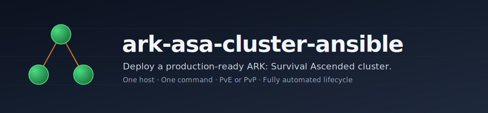

<p align="center">
  
</p>

<p align="center">
  <a href="https://github.com/donovanm21/ark-asa-cluster-ansible/actions/workflows/test.yml"></a>
  <a href="https://github.com/donovanm21/ark-asa-cluster-ansible/releases/latest"></a>
  <a href="LICENSE"></a>
  <a href="https://docs.ansible.com/"></a>
  <a href="#prerequisites"></a>
  <a href="https://hub.docker.com/r/mschnitzer/asa-linux-server"></a>
</p>

---

## Why this exists

ARK: Survival Ascended ships only a Windows dedicated server. Running a multi-map ASA cluster on Linux means wrangling Proton, hand-crafting per-map start params, juggling port maps, and remembering to pull the new image before your players notice the update. This playbook turns all of that into one YAML file and one command.

It's a self-hosted alternative to commercial offerings (Nitrado, GPortal): you bring a Linux box, it brings a working multi-map cluster.

## What you get

- **Multi-map ASA cluster** with cross-map tame/item transfer via a shared cluster directory
- **One flag** (`server_mode: PvE | PvP`) flips the relevant `.ini` switches for your play style
- **Containerised runtime** — every map is a separate `docker compose` stack on top of [`mschnitzer/asa-linux-server`](https://hub.docker.com/r/mschnitzer/asa-linux-server) (the Windows server under Proton). No `arkmanager`, no native binary juggling
- **Built-in mod support** — list CurseForge mod IDs in `map_mods_enabled` and ASA's official mod system downloads them on container start
- **Fully automated lifecycle** — the cluster keeps itself alive after `ansible-playbook` exits:
  - Daily restart + tar-backup + image-pull pipeline (with in-game RCON broadcasts)
  - Hourly image-update check — when `docker pull` reports a new digest, the daily pipeline kicks
  - 5-minute crash watchdog — a dead container comes back on its own
  - Optional Discord webhook notifications on lifecycle events
  - logrotate for each map's server logs
- **CI/CD in the box** — GitHub Actions workflows lint, syntax-check, and secret-scan on every push
- **Bring-your-own ini files** — drop hand-tuned `Game.ini` / `GameUserSettings.ini` into a local `config/` directory and the playbook overlays them on top of the rendered templates

## Quickstart

The quickest path is the CLI bootstrap — it checks your hardware, walks you through picking maps, writes the config, and runs the playbook:

```bash
git clone https://github.com/<your-fork>/ark-asa-cluster-ansible.git
cd ark-asa-cluster-ansible
sudo ./bootstrap.sh
```

[`bootstrap.sh`](bootstrap.sh) is a coloured-prompt menu with Deploy / Redeploy / Dry-run / Status / Edit / Destroy. It auto-installs `ansible-core` the first time, then stays out of your way.

Prefer the manual path?

```bash
cp group_vars/gameservers.yml.example group_vars/gameservers.yml
cp inventory_remote.example           inventory_remote
${EDITOR:-vim} group_vars/gameservers.yml
ansible-playbook -i inventory_remote main.yml
```

Both paths land in the same place. If something goes wrong, open an issue — we'd rather fix the playbook than leave you stuck.

Prefer a fully-populated starter?

| Starter | Style |
|---|---|
| [docs/examples/gameservers.pve.yml](docs/examples/gameservers.pve.yml) | 3-map PvE, friendly progression, dino wipes on |
| [docs/examples/gameservers.pvp.yml](docs/examples/gameservers.pvp.yml) | 3-map PvP, closer-to-official rates, offline raid protection |

## What a cluster looks like

```
          group_vars/gameservers.yml
       +--------------------------------+
       |  server_mode: PvE              |
       |  maps:                         |
       |   - TheIsland_WP               |
       |   - ScorchedEarth_WP           |
       |   - TheCenter_WP               |
       |  cluster_name: myCluster_PvE   |
       +--------------+-----------------+
                      |  ansible-playbook
                      v
    +----------------------------------------------+
    |              your Linux host                 |
    |  +-----------+  +-----------+  +----------+  |
    |  | container |  | container |  |container |  |
    |  | TheIsland |  | Scorched  |  |TheCenter |  |
    |  |  :7777    |  |  :7779    |  |  :7785   |  |
    |  +-----+-----+  +-----+-----+  +-----+----+  |
    |        |              |              |       |
    |        +-- /home/asa/cluster (shared)+       |
    |              (cross-map transfers)           |
    |                                              |
    |   crons:  update-check | watchdog | backup   |
    +----------------------------------------------+
```

## Prerequisites

- Linux host — Ubuntu 22.04+ or Debian 12+
- Ansible 2.10 or newer (on your workstation or the target host)
- Roughly **35 GB disk** and **8 GB RAM** per concurrently running map (ASA is heavier than ASE)
- Open UDP for each map's game port (7777+) and Steam query port (27015+); TCP for RCON port (27020+)

The playbook installs Docker Engine + the compose plugin and pre-pulls the ASA image. You only supply the host.

## Configuration

| What | Where |
|---|---|
| Who you are | `location`, `server_tag`, `server_mode` |
| Maps, ports, mods | the `maps:` list (with `map_mods_enabled` as comma-separated CurseForge IDs) |
| Gameplay feel | taming / harvest / XP multipliers, decay periods |
| Lifecycle | `daily_update_hour`, `enable_watchdog`, `enable_dino_wipe` |
| Admins | the `admins:` list of 17-digit SteamIDs |
| Discord notifications | `discord_webhook_url` |
| Your own ini files | drop into `./config/` — overlays the rendered templates |

Per-role documentation:

- [roles/provision/README.md](roles/provision/README.md) — OS deps, asa user (uid 1000), sudoers, firewall
- [roles/docker/README.md](roles/docker/README.md) — Docker Engine + compose plugin + image pre-pull
- [roles/maps/README.md](roles/maps/README.md) — per-map compose, env, Game.ini, mods, orphan reconciliation
- [roles/system/README.md](roles/system/README.md) — crontab, watchdog, RCON wrapper, logrotate, backup scripts

## Mods

ASA mods come from CurseForge (not Steam Workshop). List the numeric IDs in `map_mods_enabled` (comma-separated, no spaces) and ASA's built-in mod system downloads them on container start:

```yaml
maps:
  - map_name_ark: "TheIsland_WP"
    map_name: "TheIsland"
    ...
    map_mods_enabled: "928963,1234567"
```

Mod updates ride along with the daily restart-update pipeline — when a map restarts, ASA re-checks each mod's version against CurseForge.

## Continuous integration

Every push runs:

1. **yamllint** — style and structural linting
2. **ansible-lint** — anti-pattern detection (advisory)
3. **ansible-playbook --syntax-check** + `--list-tasks` — structural sanity
4. **gitleaks** — secret scan over the full git history

See [`.github/workflows/`](.github/workflows/).

## Contributing

PRs welcome — see [CONTRIBUTING.md](CONTRIBUTING.md).

## Security

- [SECURITY.md](SECURITY.md) documents the NOPASSWD sudo default, the UFW-removal default, the docker group default, and what to avoid committing.
- Report vulnerabilities privately to the maintainer before any public disclosure.

## Acknowledgements

Built on top of the [`mschnitzer/asa-linux-server`](https://github.com/mschnitzer/asa-linux-server) container image — that project does the heavy lifting of running the ASA Windows server under Proton. Thanks to its maintainers and to everyone who's poked holes in this playbook over the years.

## License

[MIT](LICENSE). Fork it, run it, ship your own cluster.
